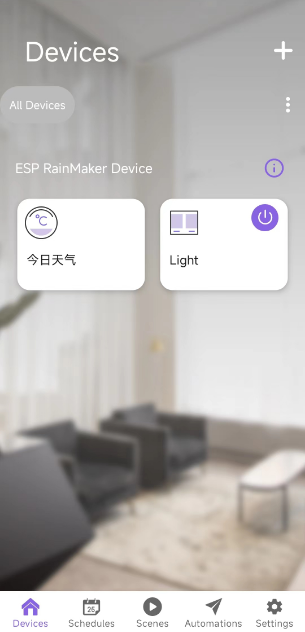
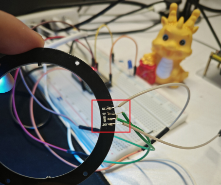
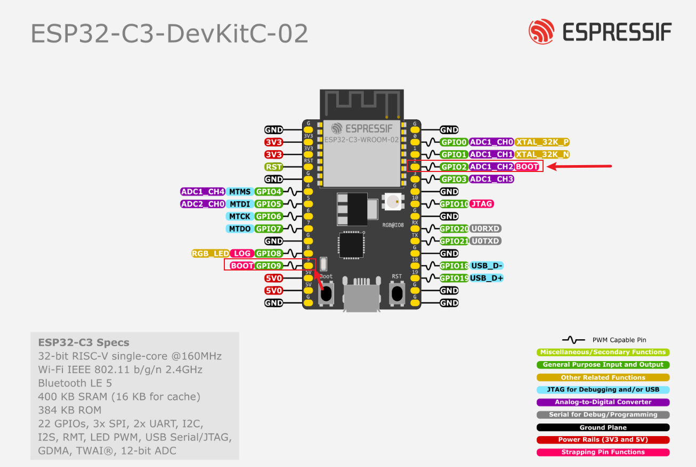
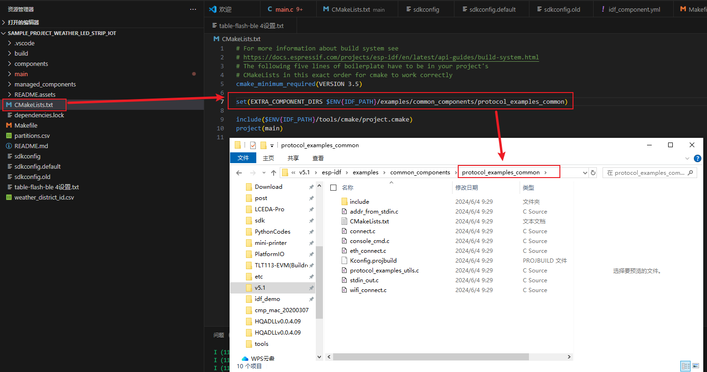
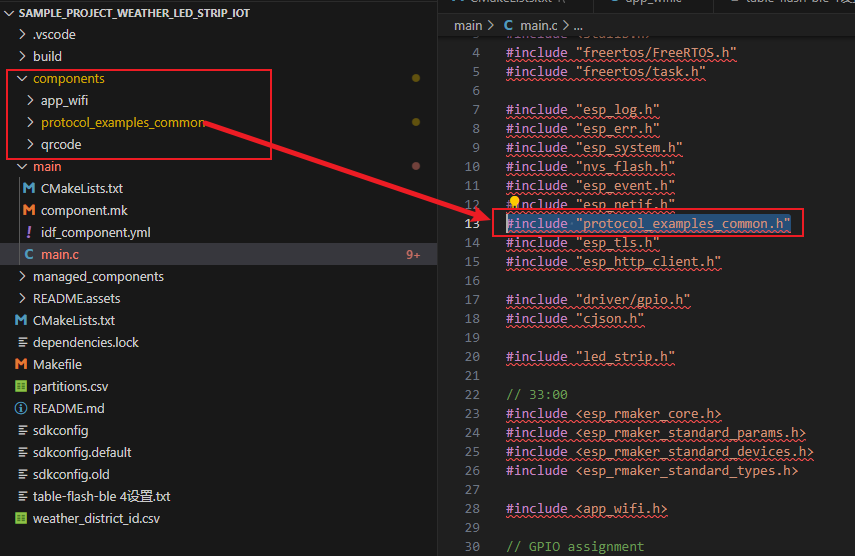

# _智能灯带_ 

>  一款可以通过手机控制的智能灯带，包括呼吸灯、流水灯模式以及根据天气变化切换模式。

**原材料：**

- WS2812 
- ESP32 C3
- ESP Rainmaker-app

**实现效果：**



**实现功能：**

1. 手机上可以远程控制智能灯带切换模式：

   - 呼吸灯

   - 流水灯

2. 手机上可以远程设置灯带色彩

3. 手机上可以远程获取天气信息

**实现步骤：**

1. 采用百度地图`api`获取天气信息
2. 实现呼吸灯和流水灯程序
3. 通过天气设置灯带模式
4. 通过ESP Rainmaker接入IOT平台
5. 升级天气和灯带控制按钮
6. 烧录程序到ESP32 C3开发板

**接线方式：**

- 5V GND 供电接ESP32开发板
- GPIO 2 接输入
- 开发板GPIO9-Boot接电阻+LED灯制作启动指示灯 【按下boot按钮LED会亮】



## 天气
> 实现逻辑：通过调用百度地图天气`api`获取信息，提取关键信息并显示。
>
> 实现步骤：
>
> - 登录百度地图`api`申请开发者密钥
> - 将连接复制到浏览器测试`api`是否可行：`http://api.map.baidu.com/weather/v1/?district_id=地区代码&data_type=all&ak=你的密钥`
>   - 深圳：district_id=440300
>   - 密钥：`ak`=自己申请

### 天气信息

```json
{
    "status": 0,
    "result": {
        "location": {
            "country": "中国",
            "province": "广东省",
            "city": "深圳市",
            "name": "深圳",
            "id": "440300"
        },
        "now": {
            "text": "阴",
            "temp": 26,
            "feels_like": 29,
            "rh": 91,
            "wind_class": "1级",
            "wind_dir": "东南风",
            "uptime": "20240606090000"
        },
        "forecasts": [
            {
                "text_day": "雷阵雨",
                "text_night": "雷阵雨",
                "high": 28,
                "low": 24,
                "wc_day": "<3级",
                "wd_day": "静风",
                "wc_night": "<3级",
                "wd_night": "静风",
                "date": "2024-06-06",
                "week": "星期四"
            },
            {
                "text_day": "中雨",
                "text_night": "雷阵雨",
                "high": 28,
                "low": 24,
                "wc_day": "<3级",
                "wd_day": "静风",
                "wc_night": "<3级",
                "wd_night": "静风",
                "date": "2024-06-07",
                "week": "星期五"
            },
            {
                "text_day": "中雨",
                "text_night": "雷阵雨",
                "high": 28,
                "low": 25,
                "wc_day": "<3级",
                "wd_day": "静风",
                "wc_night": "<3级",
                "wd_night": "静风",
                "date": "2024-06-08",
                "week": "星期六"
            },
            {
                "text_day": "多云",
                "text_night": "多云",
                "high": 30,
                "low": 26,
                "wc_day": "<3级",
                "wd_day": "静风",
                "wc_night": "<3级",
                "wd_night": "静风",
                "date": "2024-06-09",
                "week": "星期日"
            },
            {
                "text_day": "多云",
                "text_night": "多云",
                "high": 31,
                "low": 26,
                "wc_day": "<3级",
                "wd_day": "静风",
                "wc_night": "<3级",
                "wd_night": "静风",
                "date": "2024-06-10",
                "week": "星期一"
            }
        ]
    },
    "message": "success"
}
```

### 主要代码

```c
/**
 * @brief 使用 URL 执行 HTTP REST 请求
 *
 * 从指定的 URL 中执行 HTTP GET 请求，并解析返回的 JSON 数据以获取天气信息。
 *
 * @note 需要在 ESP-IDF 环境下运行
 */
static void http_rest_with_url(void)
{
    ESP_LOGI(TAG, "HTTP GET from URL");
    char local_response_buffer[MAX_HTTP_OUTPUT_BUFFER] = {0};
    esp_http_client_config_t config = {
        .url = "http://api.map.baidu.com/weather/v1/?district_id=地区代码&data_type=all&ak=你的密钥",
        .event_handler = _http_event_handler, // 事件处理函数
        .user_data = local_response_buffer, // 用于保存 HTTP 响应数据      
        .disable_auto_redirect = true, // 禁用自动重定向
    };
    esp_http_client_handle_t client = esp_http_client_init(&config);

    // GET
    esp_err_t err = esp_http_client_perform(client);
    if (err == ESP_OK) {
        ESP_LOGI(TAG, "HTTP GET Status = %d, content_length = %d",
                (int)esp_http_client_get_status_code(client), // 获取响应状态码
                (int)esp_http_client_get_content_length(client)); // 获取响应内容长度
    } else {
        ESP_LOGE(TAG, "HTTP GET request failed: %s", esp_err_to_name(err)); // 将错误码 err 转换为对应的错误字符串，以便更容易理解错误原因
    }

    // 处理天气数据
    cJSON *root = cJSON_Parse(local_response_buffer); //根节点
    // cJSON *status = cJSON_GetObjectItem(root,"status"); //节点1

    cJSON *result = cJSON_GetObjectItem(root,"result"); //节点2

    cJSON *location = cJSON_GetObjectItem(result,"location"); //节点2.1
    name = cJSON_GetObjectItem(location,"name")->valuestring;

    cJSON *now = cJSON_GetObjectItem(result,"now"); //节点2.2
    temp = cJSON_GetObjectItem(now,"temp")->valueint;
    text = cJSON_GetObjectItem(now,"text")->valuestring;
    rh = cJSON_GetObjectItem(now,"rh")->valueint;
    wind_class = cJSON_GetObjectItem(now,"wind_class")->valuestring;

    // cJSON *forecasts = cJSON_GetObjectItem(forecasts,"forecasts"); //节点2.3

    // cJSON *message = cJSON *status = cJSON_GetObjectItem(root,"message"); //节点3
    
    ESP_LOGE(TAG, "地区: %s", name);
    ESP_LOGE(TAG, "天气: %s", text);
    ESP_LOGE(TAG, "温度: %d °C", temp);
    ESP_LOGE(TAG, "湿度: %d", rh);
    ESP_LOGE(TAG, "风力: %s", wind_class);

    cJSON_Delete(root);
    esp_http_client_cleanup(client);
}
```

### 环境配置

> 在main外部的CMakeList.txt下设置：`set(EXTRA_COMPONENT_DIRS $ENV{IDF_PATH}/examples/common_components/protocol_examples_common)`, 导入 `IDF_PATH` 组件。
>
> 接着导入头文件：
>
> `#include "esp_log.h"
> #include "esp_err.h"
> #include "esp_system.h"
> #include "nvs_flash.h"
> #include "esp_event.h"
> #include "esp_netif.h"
> #include "protocol_examples_common.h"
> #include "esp_tls.h"
> #include "esp_http_client.h"`



## 自定义组件

1，新建components文件夹

2，复制需要使用的 `组件` `eg: protocol_examples_common `

3，导入组件 `eg: \#include "protocol_examples_common.h"`



## 全局变量

### GPIO

```c
// GPIO assignment
#define LED_STRIP_BLINK_GPIO  2
// Numbers of the LED in the strip
#define LED_STRIP_LED_NUMBERS 16
// 10MHz resolution, 1 tick = 0.1us (led strip needs a high resolution)
#define LED_STRIP_RMT_RES_HZ  (10 * 1000 * 1000)

#define GPIO_INPUT_PIN GPIO_NUM_9
#define MAX_HTTP_OUTPUT_BUFFER 2048
```


### 天气

```c
static const char *TAG = "HTTP_CLIENT";

static bool weather_get = false;

// 19:53
static int temp = 0; //温度
static char *name; //地区：深圳
static char *text; //天气：中雨
static char *wind_class; //风力：2级
static int rh; //湿度：91
```


### 灯带

```c
// 23:25
static uint8_t base_r = 150;
static uint8_t base_g = 150;
static uint8_t base_b = 150;

static int led_mode = 0;

static int direction = 1;
static int brightness = 0;
```


### 信号量

```c
// 信号量
SemaphoreHandle_t data_ready;
SemaphoreHandle_t json_done;
```


### ESP Rainmaker

```c
// 33:49
esp_rmaker_device_t *temp_sensor_device;
esp_rmaker_device_t *led_control;
```


## 灯带

### 主要代码

#### 灯带配置

##### `led_strip_types.h`

```c
/*
 * SPDX-FileCopyrightText: 2022-2023 Espressif Systems (Shanghai) CO LTD
 *
 * SPDX-License-Identifier: Apache-2.0
 */
#pragma once

#include <stdint.h>

#ifdef __cplusplus
extern "C" {
#endif

/**
 * @brief LED strip pixel format
 */
typedef enum {
    LED_PIXEL_FORMAT_GRB,    /*!< Pixel format: GRB */
    LED_PIXEL_FORMAT_GRBW,   /*!< Pixel format: GRBW */
    LED_PIXEL_FORMAT_INVALID /*!< Invalid pixel format */
} led_pixel_format_t;

/**
 * @brief LED strip model
 * @note Different led model may have different timing parameters, so we need to distinguish them.
 */
typedef enum {
    LED_MODEL_WS2812, /*!< LED strip model: WS2812 */
    LED_MODEL_SK6812, /*!< LED strip model: SK6812 */
    LED_MODEL_INVALID /*!< Invalid LED strip model */
} led_model_t;

/**
 * @brief LED strip handle
 */
typedef struct led_strip_t *led_strip_handle_t;

/**
 * @brief LED Strip Configuration
 */
typedef struct {
    int strip_gpio_num;      /*!< GPIO number that used by LED strip */
    uint32_t max_leds;       /*!< Maximum LEDs in a single strip */
    led_pixel_format_t led_pixel_format; /*!< LED pixel format */
    led_model_t led_model;   /*!< LED model */

    struct {
        uint32_t invert_out: 1; /*!< Invert output signal */
    } flags;                    /*!< Extra driver flags */
} led_strip_config_t;

#ifdef __cplusplus
}
#endif

```

##### 配置灯带并返回灯带对象

```c
/**
 * @brief 配置LED灯带 WS2812
 *
 * 根据LED板设计进行LED灯带的一般初始化。
 * 定义了一个名为configure_led的函数，它返回一个led_strip_handle_t类型的值，
 * 这通常是一个句柄或引用，用于后续控制和管理LED灯带。
 *
 * @return LED灯带句柄
 */
led_strip_handle_t configure_led(void)
{
    // 这里定义了一个led_strip_config_t类型的结构体变量strip_config，并为其各个字段赋值
    led_strip_config_t strip_config = {
        .strip_gpio_num = LED_STRIP_BLINK_GPIO,   // 连接到LED灯带数据线的GPIO号
        .max_leds = LED_STRIP_LED_NUMBERS,        // LED灯带上的LED数量
        .led_pixel_format = LED_PIXEL_FORMAT_GRB, //  LED灯带的像素格式（这里是GRB）
        .led_model = LED_MODEL_WS2812,            // LED灯带的型号（这里是WS2812）
        .flags.invert_out = false,                // 是否反转输出信号
    };

    // LED灯带后端配置: RMT [RMT是Espressif IoT芯片中的一个硬件特性，通常用于控制各种外设。]
    led_strip_rmt_config_t rmt_config = {
        #if ESP_IDF_VERSION < ESP_IDF_VERSION_VAL(5, 0, 0) // 在ESP_IDF_VERSION小于5.0.0的情况下，只设置了.rmt_channel字段。
                .rmt_channel = 0,
        #else // 在ESP_IDF_VERSION大于或等于5.0.0的情况下，设置了多个字段，包括：
                .clk_src = RMT_CLK_SRC_DEFAULT,        // RMT的时钟源
                .resolution_hz = LED_STRIP_RMT_RES_HZ, // RMT计数器的时钟频率
                .flags.with_dma = false,               // 是否使用DMA（Direct Memory Access）特性。
        #endif
    };

    // 创建LED灯带对象
    led_strip_handle_t led_strip;
    // 使用led_strip_new_rmt_device函数，传入之前配置的strip_config和rmt_config，创建新的LED灯带对象，并将返回的句柄存储在led_strip中
    ESP_ERROR_CHECK(led_strip_new_rmt_device(&strip_config, &rmt_config, &led_strip));
    ESP_LOGI(TAG, "Created LED strip object with RMT backend");
    return led_strip;
}
```

#### 呼吸灯实现

```c
/**
 * @brief LED呼吸灯效果
 *
 * 根据给定的LED灯带句柄，实现LED呼吸灯效果。通过循环设置每个LED的颜色，并刷新灯带实现呼吸灯效果。
 *
 * @param led_strip LED灯带句柄
 */
static void led_breth(led_strip_handle_t led_strip) {
    // 当前亮度 = 基础rgb值 * 亮度 /255
    uint8_t color_r = base_r * brightness /255;
    uint8_t color_g = base_g * brightness /255;
    uint8_t color_b = base_b * brightness /255;

    // 循环设置灯的颜色
    for (int i = 0; i < LED_STRIP_LED_NUMBERS; i++) {
        ESP_ERROR_CHECK(led_strip_set_pixel(led_strip, i, color_r, color_g, color_b));
    }

    // 点亮LED: 刷新LED灯带，使设置的颜色生效
    ESP_ERROR_CHECK(led_strip_refresh(led_strip));

    // 更新亮度值
    brightness += direction;

    // 判断亮度是否达到最大或最小，以改变呼吸灯的方向
    if (brightness == 255 || brightness == 0) {
        direction = -direction;
    }
    
}
```

#### 流水灯实现

```c
/**
 * @brief LED流动效果
 *
 * 在LED灯带上实现流动效果。从第一个LED开始，依次点亮，形成流动的视觉效果。
 *
 * @param led_strip LED灯带句柄
 */
static void led_flow(led_strip_handle_t led_strip) {
    int tail_length = 3;

    // 遍历 LED 灯带上的每个 LED
    for (int i = 0; i < LED_STRIP_LED_NUMBERS; i++) {
        // 清除 LED 灯带上的所有 LED 的颜色
        ESP_ERROR_CHECK(led_strip_clear(led_strip));

        // 遍历尾巴的长度
        for (int j = 0; j < tail_length; j++)
        {
            // 计算当前 LED 的位置
            int position = i - j;
            /** 0 ~ 15 依次亮度依次减弱
            i=0:    0
                    1 0
                    2 1 0
                    3 2 1
                    4 3 2
                    ...
            i=15:   15 14 13
            */
            if (position >= 0) {
                uint8_t tail_r = base_r - (j * (base_r / tail_length));
                uint8_t tail_g = base_g - (j * (base_g / tail_length));
                uint8_t tail_b = base_b - (j * (base_b / tail_length));

                // 设置 LED 灯带上第 position 个 LED 的颜色
                ESP_ERROR_CHECK(led_strip_set_pixel(led_strip, position, tail_r, tail_g, tail_b));
            }
        }

        // 设置头部
        // 设置 LED 灯带上第 i 个 LED 的颜色为基准颜色
        ESP_ERROR_CHECK(led_strip_set_pixel(led_strip, i, base_r, base_g, base_b));

        // 刷新 LED 灯带上的颜色
        ESP_ERROR_CHECK(led_strip_refresh(led_strip));

        // 延时 100 毫秒
        vTaskDelay(pdMS_TO_TICKS(100));
    }
}
```


## IOT赋能-智能灯带

### 头文件

```c
#include <string.h>
#include <stdio.h>
#include <stdlib.h>
#include "freertos/FreeRTOS.h"
#include "freertos/task.h"

#include "esp_log.h"
#include "esp_err.h"
#include "esp_system.h"
#include "nvs_flash.h"
#include "esp_event.h"
#include "esp_netif.h"
#include "protocol_examples_common.h"
#include "esp_tls.h"
#include "esp_http_client.h"

#include "driver/gpio.h"
#include "cjson.h"

#include "led_strip.h"

// 33:00
#include <esp_rmaker_core.h>
#include <esp_rmaker_standard_params.h>
#include <esp_rmaker_standard_devices.h>
#include <esp_rmaker_standard_types.h>

#include <app_wifi.h>
```


### 主函数

#### NVS存储

```c
esp_err_t ret = nvs_flash_init();
if (ret == ESP_ERR_NVS_NO_FREE_PAGES || ret == ESP_ERR_NVS_NEW_VERSION_FOUND) {
  ESP_ERROR_CHECK(nvs_flash_erase());
  ret = nvs_flash_init();
}
ESP_ERROR_CHECK(ret);
```

#### 连接WIFI

固定`wifi`连接 : `#include "protocol_examples_common.h"`

```c
ESP_ERROR_CHECK(esp_netif_init());
ESP_ERROR_CHECK(esp_event_loop_create_default());
ESP_ERROR_CHECK(example_connect());
ESP_LOGI(TAG, "Connected to AP, begin http example");
```

#### ESP Rainmaker APP 蓝牙配网

升级蓝牙`wifi`配网: `#include <app_wifi.h>`

```c
app_wifi_init();
```

#### Rainmaker

##### APP界面UI设置

> 使用了ESP RainMaker库的ESP32（或其他ESP系列）设备的代码片段，主要用于初始化并配置一个基于RainMaker的物联网应用。
>
> - ESP RainMaker是Espressif Systems为ESP系列芯片提供的一个云服务，用于远程监控和控制物联网设备。
>
> - 整个代码片段的主要目的是初始化ESP RainMaker服务，
>
> - 创建一个物理节点，并在这个节点下添加两个虚拟设备：一个温度传感器和一个LED控制设备。
>
> - 这些设备都带有一些参数，这些参数可以在远程的ESP RainMaker应用程序上进行查看和控制。

```c
/** 初始化rainmaker配置参数
        * 定义了一个esp_rmaker_config_t类型的结构体rainmaker_cfg，
        * 并设置enable_time_sync为false，表示不启用时间同步。
 * */ 
esp_rmaker_config_t rainmaker_cfg = {
    .enable_time_sync = false, 
};

//1 物理节点: 使用之前定义的配置初始化一个物理节点，并为其命名为“ESP RainMaker Device”，类型为“Temperature Sensor”。
esp_rmaker_node_t *node = esp_rmaker_node_init(&rainmaker_cfg, "ESP RainMaker Device", "Temperature Sensor"); 

//2 物理节点上: 创建一个温度传感器虚拟设备，命名为“今日天气”。
temp_sensor_device = esp_rmaker_temp_sensor_device_create("今日天气", NULL, 0); 

// 接下来的几行代码创建了几个参数，如“地区”、“天气”、“风力”和“湿度”，并设置了它们的属性和初始值。
esp_rmaker_param_t *name_param = esp_rmaker_param_create("地区", NULL, esp_rmaker_str(""), PROP_FLAG_READ | PROP_FLAG_WRITE);
esp_rmaker_param_t *text_param = esp_rmaker_param_create("天气", NULL, esp_rmaker_str(""), PROP_FLAG_READ | PROP_FLAG_WRITE);
esp_rmaker_param_t *wind_param = esp_rmaker_param_create("风力", NULL, esp_rmaker_str(""), PROP_FLAG_READ | PROP_FLAG_WRITE);
esp_rmaker_param_t *rh_param = esp_rmaker_param_create("湿度", NULL, esp_rmaker_int(0), PROP_FLAG_READ | PROP_FLAG_WRITE);

// 这些参数随后被添加到温度传感器虚拟设备中。
esp_rmaker_device_add_param(temp_sensor_device, name_param);
esp_rmaker_device_add_param(temp_sensor_device, text_param);
esp_rmaker_device_add_param(temp_sensor_device, wind_param);
esp_rmaker_device_add_param(temp_sensor_device, rh_param);

// 设置主要参数 app上首先显示
esp_rmaker_device_assign_primary_param(temp_sensor_device, text_param);

// 创建并设置获取天气参数的按钮
esp_rmaker_param_t *get_param = esp_rmaker_param_create("get_weather", NULL, esp_rmaker_bool(false), PROP_FLAG_READ | PROP_FLAG_WRITE);
esp_rmaker_param_add_ui_type(get_param, ESP_RMAKER_UI_PUSHBUTTON);
esp_rmaker_device_add_param(temp_sensor_device, get_param);

//3.1 添加虚拟设备-创建的温度传感器虚拟设备添加到物理节点中
esp_rmaker_node_add_device(node, temp_sensor_device); 

/** led - 创建一个自定义的设备，用于控制灯的开关和颜色。
    * 下面的代码创建了一个名为“Light”的LED控制设备，并为其添加了一个写回调函数write_cb。
    * 接着，为LED控制设备创建了两个参数：“power”和“color”，并将它们添加到设备中。
 * */ 
led_control = esp_rmaker_device_create("Light", NULL, NULL);
esp_rmaker_device_add_cb(led_control, write_cb, NULL);

esp_rmaker_param_t *power_param = esp_rmaker_param_create("power", NULL, esp_rmaker_bool(true), PROP_FLAG_READ | PROP_FLAG_WRITE);
esp_rmaker_param_add_ui_type(power_param, ESP_RMAKER_UI_TOGGLE);
esp_rmaker_device_add_param(led_control, power_param);

esp_rmaker_param_t *color_param = esp_rmaker_param_create("color", NULL, esp_rmaker_int(0), PROP_FLAG_READ | PROP_FLAG_WRITE);
esp_rmaker_param_add_ui_type(color_param, ESP_RMAKER_UI_HUE_SLIDER);
esp_rmaker_device_add_param(led_control, color_param);

// 设置主要参数 app上首先显示
esp_rmaker_device_assign_primary_param(led_control, power_param);

//3.2 添加虚拟设备-温度传感器到物理节点中
esp_rmaker_node_add_device(node, led_control); 

// 4 启动rainmaker
esp_rmaker_start(); 

// 启动WiFi连接，并使用随机生成的密钥: POP_TYPE_RANDOM 自动生成随机密钥
app_wifi_start(POP_TYPE_RANDOM);
```

##### **回调函数**

> `esp_rmaker_device_add_cb(led_control, write_cb, NULL);`

```c
/**
 * @brief 写入回调函数
 *
 * 当接收到远程或本地的参数写入请求时，该函数将被调用。
 *
 * @param device ESP RainMaker 设备指针
 * @param param ESP RainMaker 参数指针
 * @param val ESP RainMaker 参数值
 * @param priv_data 私有数据指针
 * @param ctx ESP RainMaker 写入上下文指针
 *
 * @return ESP RainMaker 错误码
 */
static esp_err_t write_cb(const esp_rmaker_device_t *device, const esp_rmaker_param_t *param,
            const esp_rmaker_param_val_t val, void *priv_data, esp_rmaker_write_ctx_t *ctx)
{
    // 如果ctx非空，这意味着回调函数是由远程请求触发的，并通过esp_rmaker_device_cb_src_to_str函数输出请求的来源。
    if (ctx) { 
        ESP_LOGI(TAG, "Received write request via : %s", esp_rmaker_device_cb_src_to_str(ctx->src));
    }

    // 获取设备名称和参数名称
    const char *device_name = esp_rmaker_device_get_name(device);
    const char *param_name = esp_rmaker_param_get_name(param);

    // 处理不同的参数:
    ESP_LOGI(TAG, "Received device_name: %s - para_name: %s", device_name, param_name);
    if (strcmp(param_name, "power") == 0) {
        ESP_LOGI(TAG, "Received power = %s ", val.val.b ? "true" : "false");
        if (val.val.b) {
            led_mode = 0; // 打开默认呼吸灯模式
        } else {
            led_mode = 2; // 关闭灯
        }
    } else if (strcmp(param_name, "flow_or_breath") == 0) {
        ESP_LOGI(TAG, "Received flow_or_breath = %s ", val.val.b ? "breath" : "flow");
        if (val.val.b) {
            led_mode = 0; // 呼吸灯模式
        } else {
            led_mode = 1; // 流水灯模式
        }
    } else if (strcmp(param_name, "color") == 0) {
        // 如果参数名为"color"，则记录接收到的整数值，并调用hue_to_rgb函数
        ESP_LOGI(TAG, "Received color = %d ", val.val.i);
        hue_to_rgb(val.val.i);
    } else if (strcmp(param_name, "weather") == 0) {
        ESP_LOGI(TAG, "Received weather = %s ", val.val.b ? "true" : "false");
        if (val.val.b) {
            shouldFetchWeather  = true;
            ESP_LOGI(TAG, "shouldFetchWeather  set to true");
        } 
    } else {
        /* Silently ignoring invalid params */
        return ESP_OK;
    }

    // 使用ESP RainMaker的API更新并报告参数的新值。
    esp_rmaker_param_update_and_report(param, val);

    // 对于其他未处理的参数，函数静默地忽略它们并返回ESP_OK
    return ESP_OK;
}
```

##### **hue_to_rgb**

```c
/**
 * @brief 将色调转换为 RGB 值
 *
 * 根据给定的色调值，将其转换为 RGB 值。
 *
 * @param hue 色调值，取值范围为 [0, 360]
 */
static void hue_to_rgb(int hue) {
    // 如果色调小于0，则将其设置为0
    if (hue < 0) {
        hue = 0;
    } 

    // 如果色调大于360，则将其设置为360
    if (hue > 360) {
        hue = 360;
    }

    // 如果色调小于120
    if (hue < 120) {
        // 计算红色分量
        base_r = 255 - hue * 2;
        // 计算绿色分量
        base_g = hue * 2;
        // 蓝色分量为0
        base_b = 0;
    // 如果色调在120到240之间
    } else if (hue < 240) {
        // 红色分量为0
        base_r = 0;
        // 计算绿色分量
        base_g = 255 - (hue - 120) * 2;
        // 计算蓝色分量
        base_b = (hue - 120) * 2;
    // 如果色调大于240
    } else {
        // 计算红色分量
        base_r = (hue - 240) * 2;
        // 绿色分量为0
        base_g = 0;
        // 计算蓝色分量
        base_b = 255 - (hue - 240) * 2;
    }
}
```


---

#### led_task

```c
static void led_task(void *pvParameters) {
    led_strip_handle_t led_strip = configure_led();
    while (1)
    {
        if (xSemaphoreTake(data_ready, pdMS_TO_TICKS(10)) == pdTRUE) {
            if (strstr(text, "晴")) {
                led_mode = 0;
                base_r = 255;
                base_g = 253;
                base_b = 18;
            } else if (strstr(text, "雨")) {
                led_mode = 1;
                base_r = 255;
                base_g = 18;
                base_b = 18;
            } else if (strstr(text, "阴")) {
                led_mode = 1;
                base_r = 160;
                base_g = 32;
                base_b = 240;
            } else if (strstr(text, "云")) {
                led_mode = 1;
                base_r = 240;
                base_g = 230;
                base_b = 140;
            } 
            // 在读取完天气内容后，可以传递信号量给 HTTP 任务，让 HTTP 任务释放 JSON 数据
            xSemaphoreGive(json_done);
        }

        if (led_mode == 0) {
            led_breth(led_strip);
        } else if (led_mode == 1) {
            led_flow(led_strip);
        } else if (led_mode == 2) {
            ESP_ERROR_CHECK(led_strip_clear(led_strip));
            vTaskDelay(pdMS_TO_TICKS(200));
        }
    }
    vTaskDelete(NULL);
}
```


#### http_test_task

```c
/**
 * @brief HTTP 测试任务
 *
 * 该函数是一个无限循环的任务，用于执行 HTTP 测试。当指定的 GPIO 输入引脚为低电平时，
 * 会调用 http_rest_with_url() 函数进行 HTTP 请求，并延迟一段时间。否则，仅延迟一段时间。
 *
 * @param pvParameters 任务参数指针
 */
static void http_test_task(void *pvParameters)
{
    ESP_LOGI(TAG, "http_test_task started!");
    while (1) {
        if (gpio_get_level(GPIO_INPUT_PIN) == 0 || weather_get == true) {       
            http_rest_with_url();
            weather_get = false;
            vTaskDelay(100 / portTICK_PERIOD_MS);
        }
        vTaskDelay(100 / portTICK_PERIOD_MS);
    }
    vTaskDelete(NULL);

    // http_rest_with_url();
    // vTaskDelete(NULL);
}
```


#### 整体函数

```c
/**
 * @brief 应用程序主入口函数
 *
 * 初始化NVS存储，连接WiFi，启动RainMaker服务，并创建HTTP测试任务和LED控制任务。
 */
void app_main(void)
{
    esp_err_t ret = nvs_flash_init();
    if (ret == ESP_ERR_NVS_NO_FREE_PAGES || ret == ESP_ERR_NVS_NEW_VERSION_FOUND) {
      ESP_ERROR_CHECK(nvs_flash_erase());
      ret = nvs_flash_init();
    }
    ESP_ERROR_CHECK(ret);

    // ------------------------------------wifi--------------------------------------start
    // 1. 固定wifi配置信息
    // ESP_ERROR_CHECK(esp_netif_init());
    // ESP_ERROR_CHECK(esp_event_loop_create_default());
    // ESP_ERROR_CHECK(example_connect());
    // ESP_LOGI(TAG, "Connected to AP, begin http example");
    // 2. 升级wifi配网: 在手机app上通过蓝牙给设备配置wifi连接
    app_wifi_init();
    // ------------------------------------wifi--------------------------------------end

    // ---------------------------------------rainmaker---------------------------------------start
    // 初始化rainmaker配置参数
    esp_rmaker_config_t rainmaker_cfg = {
        .enable_time_sync = false,
    };
    esp_rmaker_node_t *node = esp_rmaker_node_init(&rainmaker_cfg, "ESP RainMaker Device", "Temperature Sensor"); //1 物理节点

    temp_sensor_device = esp_rmaker_temp_sensor_device_create("今日天气", NULL, 0); //2 物理节点上的虚拟设备-温度传感器

    esp_rmaker_param_t *name_param = esp_rmaker_param_create("地区", NULL, esp_rmaker_str(""), PROP_FLAG_READ | PROP_FLAG_WRITE);
    esp_rmaker_param_t *text_param = esp_rmaker_param_create("天气", NULL, esp_rmaker_str(""), PROP_FLAG_READ | PROP_FLAG_WRITE);
    esp_rmaker_param_t *wind_param = esp_rmaker_param_create("风力", NULL, esp_rmaker_str(""), PROP_FLAG_READ | PROP_FLAG_WRITE);
    esp_rmaker_param_t *rh_param = esp_rmaker_param_create("湿度", NULL, esp_rmaker_int(0), PROP_FLAG_READ | PROP_FLAG_WRITE);

    esp_rmaker_device_add_param(temp_sensor_device, name_param);
    esp_rmaker_device_add_param(temp_sensor_device, text_param);
    esp_rmaker_device_add_param(temp_sensor_device, wind_param);
    esp_rmaker_device_add_param(temp_sensor_device, rh_param);

    // 设置主要参数 app上首先显示
    esp_rmaker_device_assign_primary_param(temp_sensor_device, text_param);

    // 创建获取天气参数的按钮
    esp_rmaker_param_t *get_param = esp_rmaker_param_create("get_weather", NULL, esp_rmaker_bool(false), PROP_FLAG_READ | PROP_FLAG_WRITE);
    esp_rmaker_param_add_ui_type(get_param, ESP_RMAKER_UI_PUSHBUTTON);
    esp_rmaker_device_add_param(temp_sensor_device, get_param);

    esp_rmaker_node_add_device(node, temp_sensor_device); //3.1 添加虚拟设备-温度传感器到物理节点中

    // led - 创建一个自定义的设备，用于控制灯
    led_control = esp_rmaker_device_create("Light", NULL, NULL);
    esp_rmaker_device_add_cb(led_control, write_cb, NULL);
   
    esp_rmaker_param_t *power_param = esp_rmaker_param_create("power", NULL, esp_rmaker_bool(true), PROP_FLAG_READ | PROP_FLAG_WRITE);
    esp_rmaker_device_add_param(led_control, power_param);
    esp_rmaker_device_assign_primary_param(led_control, power_param);

    esp_rmaker_param_t *color_param = esp_rmaker_param_create("color", NULL, esp_rmaker_int(0), PROP_FLAG_READ | PROP_FLAG_WRITE);
    esp_rmaker_param_add_ui_type(color_param, ESP_RMAKER_UI_HUE_SLIDER);
    esp_rmaker_device_add_param(led_control, color_param);

    esp_rmaker_node_add_device(node, led_control); //3.2 添加虚拟设备-温度传感器到物理节点中

    esp_rmaker_start(); // 4 启动rainmaker

    // POP_TYPE_RANDOM 自动生成随机密钥
    app_wifi_start(POP_TYPE_RANDOM);
    // ---------------------------------------rainmaker---------------------------------------end

    data_ready = xSemaphoreCreateBinary();
    json_done = xSemaphoreCreateBinary();

    // 【HTTP任务】
    xTaskCreate(&http_test_task, "http_test_task", 8192, NULL, 5, NULL);

    // 流程：解析JSON数据【HTTP任务】 -> 使用被解析后的数据【LED任务】 -> 释放JSON数据【HTTP任务】
    // 1， LED 任务只使用被完全解析后的天气信息
    // 2，LED 任务要在JSON数据被释放之前完成读取
    xTaskCreate(&led_task, "led_task", 8192, NULL, 5, NULL);
}
```

遇到的问题：`Guru Meditation Error: Core  1 panic'ed (LoadProhibited). Exception was unhandled.`

如何解决：取消上报信息

```c
static void data_report() {
    ESP_LOGI(TAG, "data_report...");

    // 更新并报告温度参数
    // esp_rmaker_param_update_and_report(
    //         esp_rmaker_device_get_param_by_type(temp_sensor_device, "温度"),
    //         esp_rmaker_str(temp));

    // // 更新并报告天气参数
    // esp_rmaker_param_update_and_report(
    //         esp_rmaker_device_get_param_by_type(temp_sensor_device, "天气"),
    //         esp_rmaker_str(text));

    // 更新并报告地区参数
    // esp_rmaker_param_update_and_report(
    //         esp_rmaker_device_get_param_by_type(temp_sensor_device, "地区"),
    //         esp_rmaker_str(name));

    // // 更新并报告风力参数
    // esp_rmaker_param_update_and_report(
    //         esp_rmaker_device_get_param_by_type(temp_sensor_device, "风力"),
    //         esp_rmaker_str(wind_class));

    // // 更新并报告湿度参数
    // esp_rmaker_param_update_and_report(
    //         esp_rmaker_device_get_param_by_type(temp_sensor_device, "湿度"),
    //         esp_rmaker_int(rh));

    vTaskDelay(pdMS_TO_TICKS(100));

    // 如果天气文本中包含"雨"字
    if (strstr(text, "雨") != NULL)
    {
        // 触发下雨警告
        esp_rmaker_raise_alert("下雨了，注意带伞!");
    }

    // 如果温度大于20度
    if (temp > 20)
    {
        // 触发高温警告
        esp_rmaker_raise_alert("高温天气，小心中暑!");
    }
    
}


// esp_rmaker_param_t *temp_param = esp_rmaker_param_create("温度", "温度", esp_rmaker_str(""), PROP_FLAG_READ | PROP_FLAG_WRITE);
    // esp_rmaker_param_t *name_param = esp_rmaker_param_create("地区", "Name", esp_rmaker_str(""), PROP_FLAG_READ | PROP_FLAG_WRITE);
    // esp_rmaker_param_t *text_param = esp_rmaker_param_create("天气", "Name", esp_rmaker_str(""), PROP_FLAG_READ | PROP_FLAG_WRITE);
    // esp_rmaker_param_t *wind_param = esp_rmaker_param_create("风力", "风力", esp_rmaker_str(""), PROP_FLAG_READ | PROP_FLAG_WRITE);
    // esp_rmaker_param_t *rh_param = esp_rmaker_param_create("湿度", "湿度", esp_rmaker_str(""), PROP_FLAG_READ | PROP_FLAG_WRITE);

    // 这些参数随后被添加到温度传感器虚拟设备中。
    // esp_rmaker_device_add_param(temp_sensor_device, temp_param);
    // esp_rmaker_device_add_param(temp_sensor_device, name_param);
    // esp_rmaker_device_add_param(temp_sensor_device, text_param);
    // esp_rmaker_device_add_param(temp_sensor_device, wind_param);
    // esp_rmaker_device_add_param(temp_sensor_device, rh_param);

```


